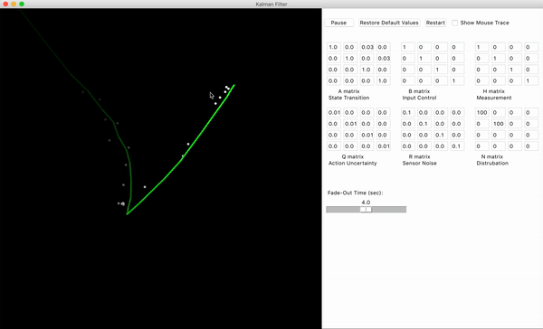
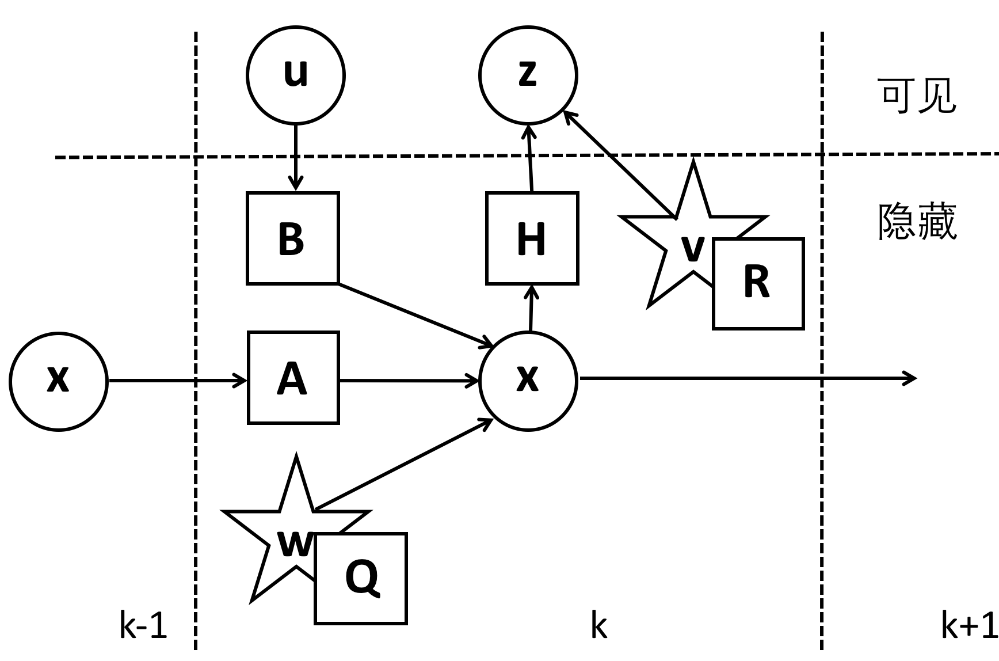

# 鼠标追踪和卡尔曼滤波器

本篇主要介绍一个鼠标追踪的小程序。程序的GUI（graphic user interface ）部分是用python的tkinter来实现，追踪算法是用卡尔曼滤波器来实现。

在正文之前，我首先致谢(ackownledge)我所采用的参考资料。程序部分主要参考了[Richard Teammco](https://www.cs.utexas.edu/~teammco/misc/kalman_filter/)的JavaScript代码，我对其中极小的错误进行了修改, 删减了我认为不重要的功能。因为本人不会JavaScript，所以我改成了python的代码。GUI动画的引擎参考了[Irmen de Jong](https://github.com/irmen/rocketsimulator)的程序。

程序的效果如图所示，[代码](https://github.com/yanfeit/Kalman-Filter)可以自取。

[TOC]

## 卡尔曼滤波器简介

### 模型

有关卡尔曼滤波器的介绍已经很多了，其中底层的模型类似于隐马可夫模型，中文维基百科的介绍就很好。在这里我就不班门弄斧了，只是简略地描述一下。

卡尔曼滤波器模型假设有一个真实的状态$\mathbf{x}_k$, 这个真实的状态是从前一个状态$\mathbf{x}_{k-1}$演化过来的，同时也存在一个控制单元$\mathbf{u}_k$对状态$\mathbf{x}_k$进行不断地调整。前面这段话对于初学卡尔曼滤波器的同学可能很难理解，这里举个例子，比如说我要追踪一枚弹道导弹，这枚弹道导弹的状态$\mathbf{x}_k$包括两部分组成，位置和速度。受到惯性的作用，这枚导弹的位置和速度肯定是前一个状态$\mathbf{x}_{k-1}$演化到的。导弹在飞行的过程中又受到了地球引力和导弹控制单元的影响，我们可以把这些影响（也就是加速度）囊括在矢量$\mathbf{u}_k$中。假设整个演化的过程是线性的，那么$\mathbf{x}_k$满足下式：
$$
\mathbf{x}_k = \mathbf{A}_k\mathbf{x}_{k-1} + \mathbf{B}_k\mathbf{u}_k + \mathbf{w}_k, \tag{1}
$$
其中$\mathbf{A}_k$是作用在状态$\mathbf{x}_k$的转化矩阵，$\mathbf{B}_k$是作用在控制单元$\mathbf{u}_k$的控制矩阵，$\mathbf{w}_k$是过程的噪声，可以认为噪声符合多维正态分布$\mathbf{w}_k \sim  N(0, \mathbf{Q}_k)$。基本的卡尔曼滤波器模型是线性的，当然真实的物理很少是线性的，比如说刚才举例的弹道导弹的例子，由于不可忽略的空气阻力的存在，并且空气阻力和速度有复杂的非线性的关系，模型一定是非线性的，这里我就不做展开了。在每一个时刻$k$，我们都会对状态$\mathbf{x}_k$进行一个测量，
$$
\mathbf{z}_k = \mathbf{H}_k \mathbf{x}_k + \mathbf{v}_k, \tag{2}
$$
其中$\mathbf{z}_k$是测量状态，$\mathbf{H}_k$是把真实空间映射到观测空间的转换矩阵，$\mathbf{v}_k$是观测过程中的噪声，同样也认为满足多维的正态分布$\mathbf{v}_k \sim N(0, \mathbf{R}_k)$。 

一画胜千言，上图是关于卡尔曼滤波器模型的描述，其中圆圈代表矢量，方块代表矩阵，星号代表高斯噪声，它的协方差矩阵在其右下角已经标出。熟悉神经网络的同学，类似于RNN结构，对于卡尔曼滤波器肯定不会陌生。

### 迭代算法

卡尔曼滤波器是一种递归的估计，它需要知道之前一段的历史状态，即$\mathbf{x}_{k-1}$。同时我们又知道当前的一些信息，即控制单元$\mathbf{u}_k$和观测$\mathbf{z}_k$。我们可以粗略地想象这样的迭代算法可以是由两部分组成的，一部分是首先根据前一段的信息去估计当前的状态，第二部分是根据已知的当前信息纠正先前的估计。这听起来像是predictor corrector算法（我不喜欢中文把他翻译成预测校正算法）我更愿意称它为**预测子-校正子算法**。这样的叫法提醒我们，需要计算一个预测子，之后再计算一个校正子，校正子也就是我们k时刻最后的输出。

我们定义$\mathbf{\hat{x}'}_k$为k时刻先验估计，也就是我们的预测子，
$$
\mathbf{\hat{x}'}_k = \mathbf{A} \mathbf{\hat{x}}_{k-1} + \mathbf{B} \mathbf{u}_k, \tag{3}
$$
其中$\mathbf{\hat{x}}_{k-1}$是k-1时刻的后验估计，也就是我们的校正子，k时候的校正子即为$\mathbf{\hat{x}}_{k}$。有了预测子和校正子，我们可以定义他们和真实的状态$\mathbf{x}_k$之间的误差，对于预测子我们叫先验误差$\mathbf{e}'_k$，对于校正子我们叫后验误差$\mathbf{e}_k$, 
$$
\mathbf{e}'_k \equiv \mathbf{x}_k - \mathbf{\hat{x}'}_k, \\
\mathbf{e}_k  \equiv \mathbf{x}_k - \mathbf{x}_k。  \tag{4}
$$
先验误差的协方差矩阵$\mathbf{P'}_k$和后验误差的协方差矩阵$\mathbf{P}_k$分别为
$$
\mathbf{P'}_k =  E[\mathbf{e}'_k {\mathbf{e}'_k}^{T}], \\
\mathbf{P}_k =  E[\mathbf{e}_k {\mathbf{e}_k}^{T}]。 \tag{5}
$$
有了这些定义，我们的目标就很明确了，一个好的校正子意味着它与真实的状态之间的误差相差无几。那么，很显然我们希望后验误差尽可能的小，在数学上也就是我们希望协方差矩阵$\mathbf{P}_k$的迹尽可能的小。

我这里不会去推导整个流程，具体怎么得到最小化的流程可以参考[Tony Lacey]([http://web.mit.edu/kirtley/kirtley/binlustuff/literature/control/Kalman%20filter.pdf](http://web.mit.edu/kirtley/kirtley/binlustuff/literature/control/Kalman filter.pdf))的笔记。根据公式(3)， 有了之前的后验估计$\mathbf{\hat{x}}_{k-1}$， 我可以求出先验估计$\mathbf{\hat{x}'}_k$。但怎么从先验估计计算k时刻的后验估计，我们却不清楚。我们大胆假设k时刻的后验估计$\mathbf{\hat{x}}_{k}$和先验估计$\mathbf{\hat{x}’}_{k}$存在如下的关系，
$$
\mathbf{\hat{x}}_{k} = \mathbf{\hat{x}’}_{k} + \mathbf{K}_k (\mathbf{z}_k -  \mathbf{H} \mathbf{\hat{x}’}_{k})， \tag{6}
$$
其中我们把$\mathbf{z}_k -  \mathbf{H} \mathbf{\hat{x}’}_{k}$称为测量余量，$\mathbf{K}_k$称为卡尔曼增益。毫无疑问整个推导流程必然是找到一个最优的卡尔曼增益，这里我直接给出最优卡尔曼增益的结果，
$$
\mathbf{K}_k = \mathbf{P'}_k \mathbf{H}^T (\mathbf{H} \mathbf{P'}_k \mathbf{H}^T + \mathbf{R})^{-1} \tag{7}
$$
到这里，我们基本上已经得到了真个算法的流程（我们还缺少协方差矩阵的递归公式，这里就不详细介绍了）。下面我就直接给出卡尔曼滤波器的伪代码，

**预测：**
$$
\mathbf{\hat{x}'}_k = \mathbf{A} \mathbf{\hat{x}}_{k-1} + \mathbf{B} \mathbf{u}_k \\
\mathbf{P}'_k = \mathbf{A} \mathbf{P}_{k-1} \mathbf{A}^T + \mathbf{Q}。
$$
**校正：**
$$
\mathbf{K}_k = \mathbf{P'}_k \mathbf{H}^T (\mathbf{H} \mathbf{P'}_k \mathbf{H}^T + \mathbf{R})^{-1}, \\
\mathbf{\hat{x}}_{k} = \mathbf{\hat{x}’}_{k} + \mathbf{K}_k (\mathbf{z}_k -  \mathbf{H} \mathbf{\hat{x}’}_{k}), \\
\mathbf{P}_k = (\mathbf{I} - \mathbf{K}_k \mathbf{H}) \mathbf{P}'_k 。
$$
初始化的时候我们需要假设一个$\mathbf{\hat{x}}_0$和$\mathbf{P}_{0}$。通过不停地递归，我们就可以得到每一步的校正子和后验误差的协方差矩阵了。

## 程序介绍

程序是建立在一个二维的画布上，我们需要去追踪鼠标的位置。

白色的渐变点代表着对鼠标位置的测量也就是前文所说的$\mathbf{z}_k$，当然速度我们是没法显示的。绿色的线段是卡尔曼滤波器的输出，也就是我们的校正子$\mathbf{\hat{x}_k}$。而蓝色的线段是真实的鼠标位置。

二维空间坐标的真实状态$\mathbf{x}_k$可以写作为，
$$
\mathbf{x}_k = \begin{bmatrix}
   x_k \\
   y_k \\
   \dot{x}_k \\
   \dot{y}_k \\
\end{bmatrix} = 
\begin{bmatrix}
1 & 0 & \delta t & 0 \\
0 & 1 & 0 & \delta t \\
0 & 0 & 1 & 0        \\
0 & 0 & 0 & 1  
\end{bmatrix} \times \begin{bmatrix}
   x_{k-1} \\
   y_{k-1} \\
   \dot{x}_{k-1} \\
   \dot{y}_{k-1} \\
\end{bmatrix} + \begin{bmatrix}
\delta t^2/2 & 0 \\
0 & \delta t^2/2 \\
\delta t & 0        \\
0 & \delta t 
\end{bmatrix} \times \begin{bmatrix}
\ddot{x}_{k-1}  \\
\ddot{y}_{k-1}
\end{bmatrix}= \mathbf{A} \mathbf{x}_{k-1} + \mathbf{B} \mathbf{u}_k \tag{8}
$$
在这个简单的系统中，我们没有控制单元$\mathbf{u}_k$，因为我们不知道模型的加速度等（大大地简化了我们的模型）。模型噪声的来源可以假设是一个多维的高斯分布。